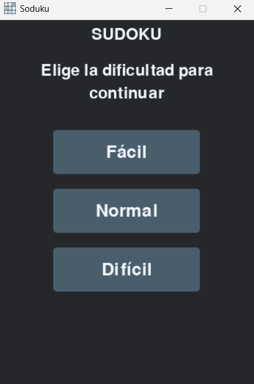
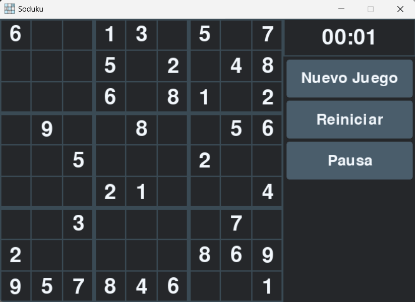
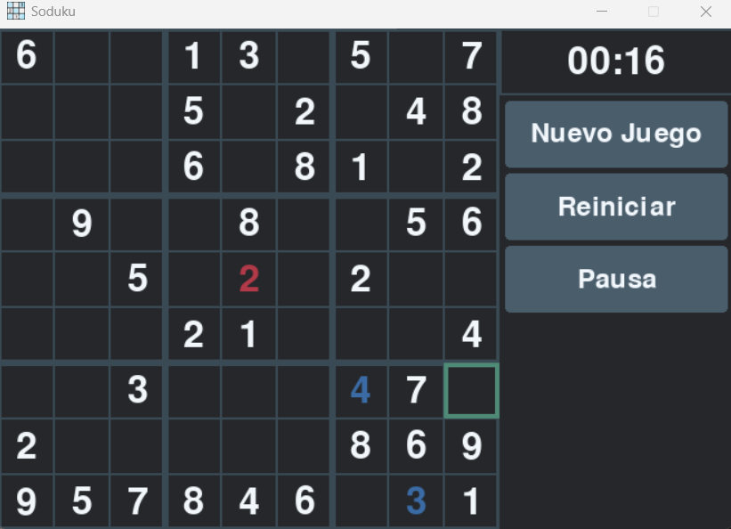
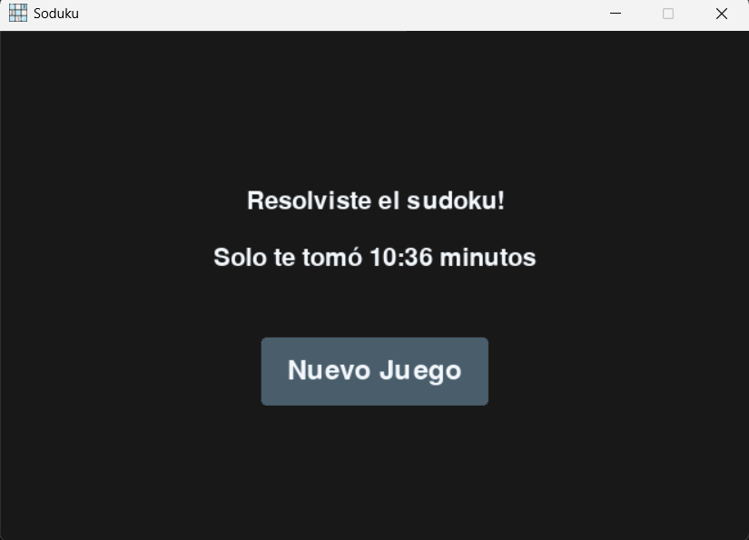

# Sudoku 🧩

Sudoku is a desktop puzzle game built with **Python** and **Pygame**,
designed with a clean separation between game logic and rendering. The
project is distributed as a **standalone Windows installer**, making it
easy to install and play without requiring Python.

## 🎮 Features

-   3 difficulty levels (Easy, Normal, Hard)
-   Mouse and keyboard controls
-   Timer with pause support
-   Game state handling (Menu, Playing, Paused, Game Over)
-   Visual feedback for invalid moves
-   Clean and modular architecture
-   Logging system for development and debugging
-   Windows installer (.exe)

## 🛠 Tech Stack

-   Python 3.10.11
-   Pygame
-   PyInstaller
-   Inno Setup

## 📦 Installation (Windows)

1.  Go to the **Releases** section:
    https://github.com/DanMG20/Sudoku/releases
2.  Download the latest installer.
3.  Run the installer and start playing.

## ▶ Run from Source

### Requirements
- Python 3.10.11


### Steps
``` bash
git clone https://github.com/DanMG20/Sudoku.git
cd Sudoku
pip install -r requirements.txt
python main.py
```

## 🧠 Project Architecture

-   Game → Handles game logic and state
-   Render → Responsible only for drawing
-   Board → Sudoku board logic and validation
-   EventManager → Input handling
-   Button → Reusable UI components
-   SudokuGenerator → Puzzle generation
-   logger_config → Centralized logging configuration

The architecture was intentionally designed to keep the codebase clean,
readable, and easy to extend.

## 📸 Screenshots

### Main Menu


### Playing




### End game



## 📄 License

MIT License

## 👤 Author

Edgar Molina\
GitHub: https://github.com/DanMG20


This project was built as a personal portfolio project to demonstrate
clean architecture, game state management, and desktop application packaging.
